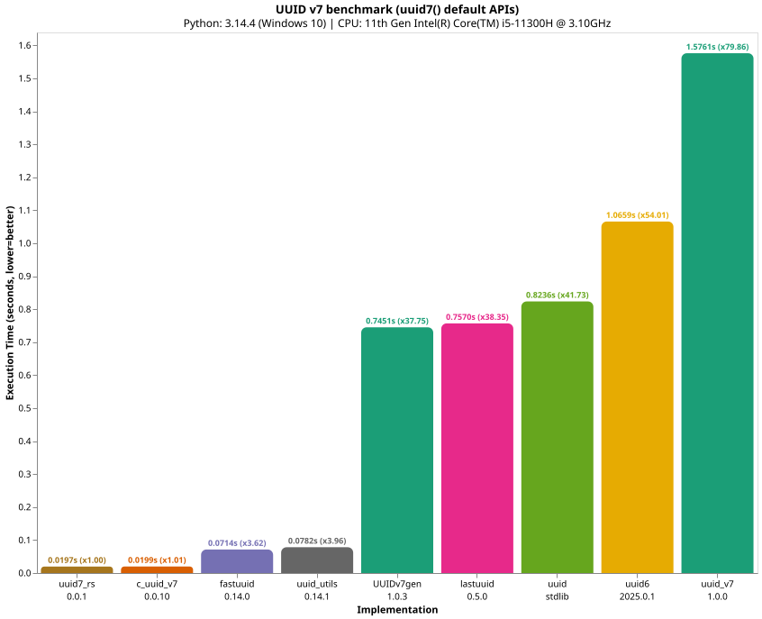
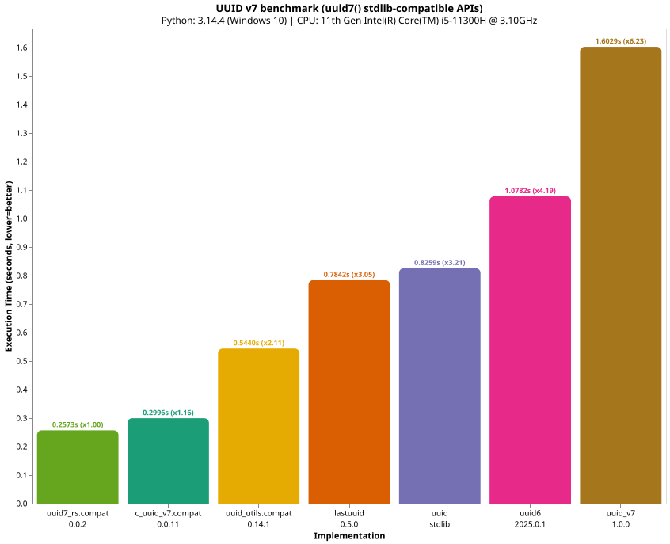

# To run the benchmarks

## Create and activate virtual environment

Linux / macOS:

```bash
python3 -m venv .venv
source .venv/bin/activate
```

Windows:

```bash
py -m venv .venv
.venv\scripts\activate
```

## Install benchmark dependencies

Using pip:

```bash
pip install . --group bench
```

Using uv:

```bash
uv pip install . --group bench
```

## Run `benchmark/run.py`

```bash
python benchmark/run.py
```

## Results

### `uuid7()` default APIs



### `uuid7()` compact / stdlib-compatible APIs


